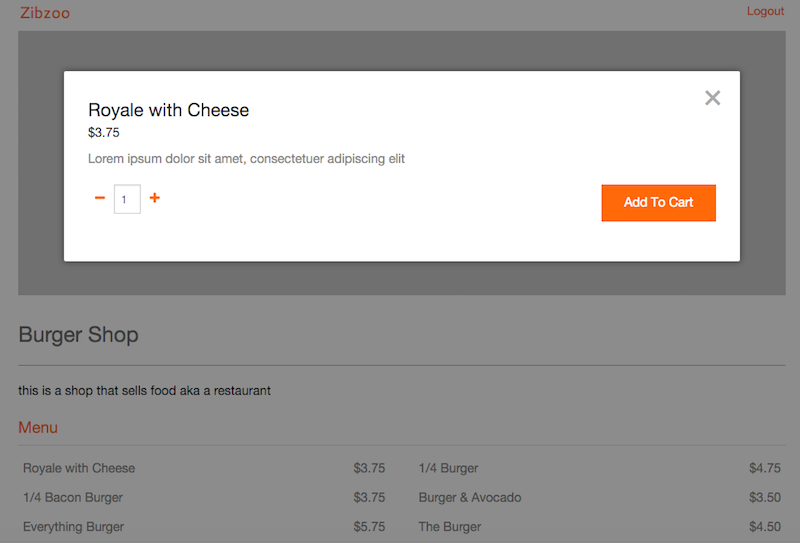
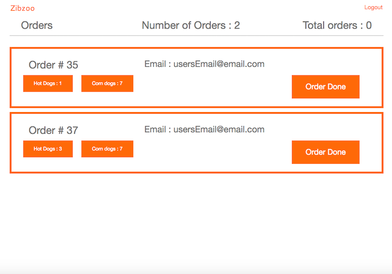

# Our Story

Are you hungry, and looking for some food?  Keep hearing about some great truck around the area but dont know where it is?  Even when you get there you waste your time waiting in line just to grab something that might have just run out.   Well no more, welcome to Zibzoo.
With Zibzoo you can browse the foodtrucks in your area and check out their menus before you go.  Anyone can use ZibZoo, but by signing up with us you can avoid the lines.  When you register with Zibzoo and are ready to complete your order, we handle all the details; you just have to pick up your food. Not sure when it will be ready? No worries; when a merchant has finished your food you'll receive an email letting you know its ready.

Coming to Zibzoo as a vendor? Great, we've made it easy to manage your account.  Simply sign up with us, from here you can do everything you need.  Edit your profile, create new items, re-arrange your menu and take care of customer orders. Once you finish an order we'll notify your customers that they can pick up their food. Because we handle all the transactions, you dont have to worry about dealing with the money, instead you'll simply hand off orders to your customers.  No fuss, no lines and you get to focus on what really matters.

# User Interaction

Browse food trucks in your area

Choose a vendor and check out their menu

Wait, you can see menus but before you can order any food online, you need to log in.

Grab some food and add it to your cart, want to grab food from more then one vendor? No problem, feel free to add items from diffrent vendors

Once your ready to finish, head over to your order cart and double check your food

Finaly just place your order and confirm your payment.  We take care of all the details so you dont have to.  All you need to do now is go pick up your food.

Don't want to head out untill your food is ready? Don't have the time to get out there untill you know your food is ready.  Well we have you covered.  Once a vendor finishes you food, you'll automaticaly receive an email letting you know its all finsihed.

# Vendor Interaction

Coming to Zibzoo as a vendor and woundering how we can help you out?  Well when you sign up with Zibzoo we try to make things easy for you.

Edit your profile

Add items to your menu

Need to reorganize your menu? no problem simply drag and drop any item or any catagorie of food

Finaly take care of all your orders.  You can remove individual food items from orders, or complete an order all together. View how many orders you currently have, as well as a counter for how many orders you've had this session.  Dont worry about contacting people, when you finish an order we automaticaly send off emails to the person who ordered it.  Just make sure to write down their order numbers and emails just in case.

