# Our Story

With the breadth of food trucks in San Francisco, the choice can be overwhelming.  When you do decide on a truck, waiting in line only to find out your favorite item has sold out can be frustrating; especially when you only have an hour for lunch.
What if you could place your order before going on lunch and bypass all of the lines at your favorite food truck? Using Zibzoo this dream becomes a reality.
Zibzoo is a web application that removes the hassle of ordering from popular food trucks by allowing you to pre-order your meal and pick it up at your convenience.

When you first log on to Zibzoo, it will find your current location and show you a list of food trucks in your area. Want to order from food trucks that aren't in your area? Just type a location and Zibzoo will pull up all the food trucks nearby.

When you decide on a truck you'll be taken to its menu page. There you can browse all that the food truck has to offer and be updated in real time when those items become unavailable. When something catches your eye, add it to your cart. Ordering for a group? No worries, you can add items from multiple vendors to your cart.  When you're ready to checkout, confirm and pay. Zibzoo will intelligently send your orders to the desired trucks. The vendors will be notified immediately of your order, allowing them to fulfill it as quickly as possible.

As a vendor Zibzoo allows you to dynamically adjust your business so you're always ready for any situation. Adjust your menu to showcase underperforming items or change the look or feel of it by simply dragging and dropping entire sections. When you have fulfilled an order notify your customer via email with a single click

Zibzoo delivers a clean and dynamic interface by leveraging Angular JS as the client side framework. To ensure quick and reliable data access and distribution, Zibzoo's server was built using Express and Node.js. Zibzoo also harnesses the power of MongoDB to provide lightning fast data lookup, Socket.io for robust real time event-based communication, and Stripe, for secure and reliable payment processing.

Zibzoo was created by a team of 5 full stack software engineers, Benji Marinacci, Tom Bergen, Ahmed Modan, Ian Bari, & Christopher Decker.

Zibzoo.
Food Trucks will never be the same.

Check us out today at http://zibzoo.com

# User Interaction

- Browse food trucks in your area

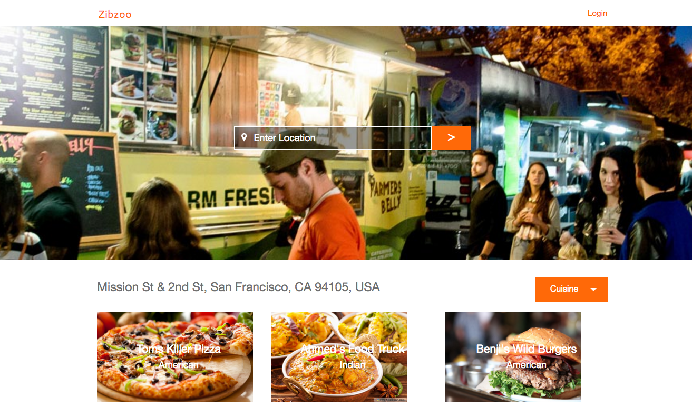

- Choose a vendor and check out their menu

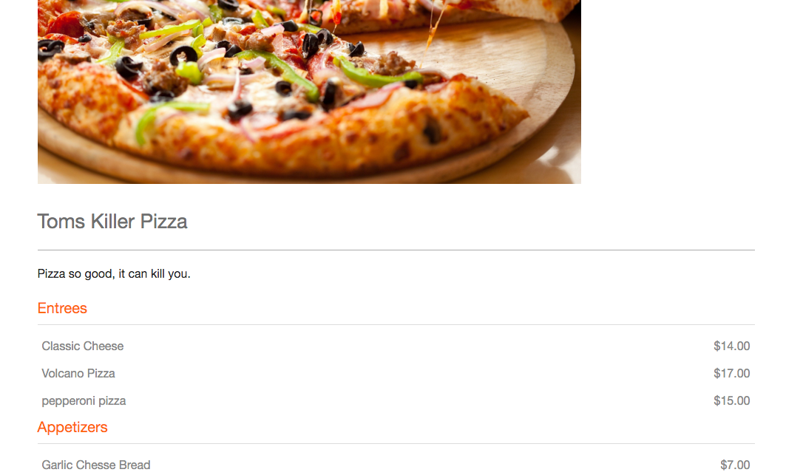

- Wait, you can see menus but before you can order any food online, you need to log in.

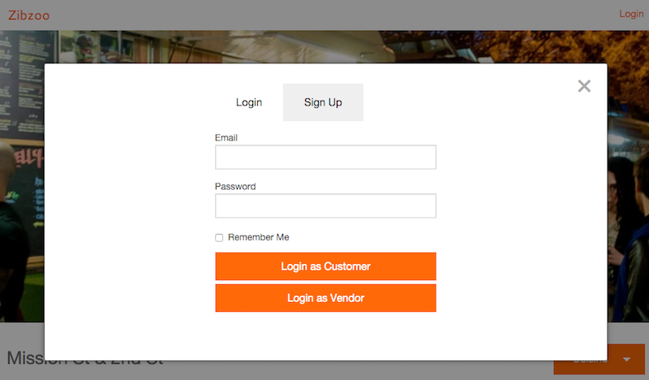

- Grab some food and add it to your cart, want to grab food from more then one vendor? No problem, feel free to add items from diffrent vendors

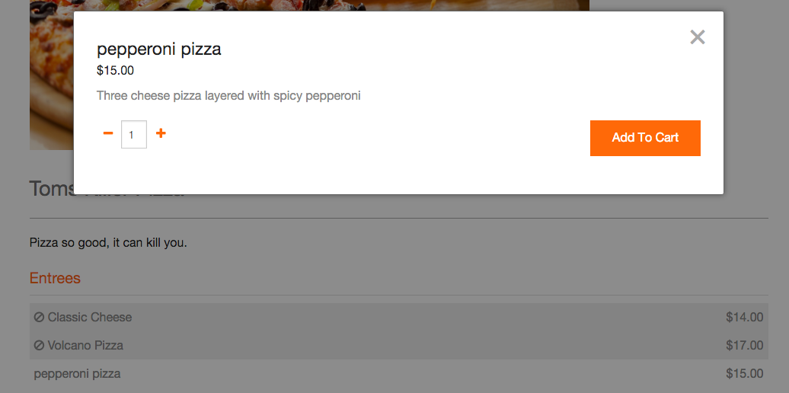

- Once your ready to finish, head over to your order cart and double check your food

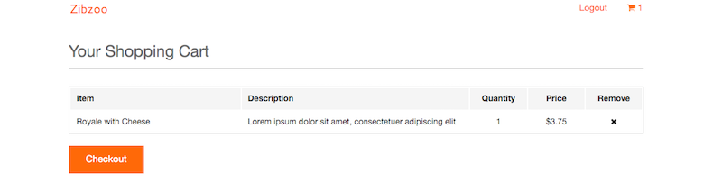

- Finaly just place your order and confirm your payment.  We take care of all the details so you dont have to.  All you need to do now is go pick up your food.

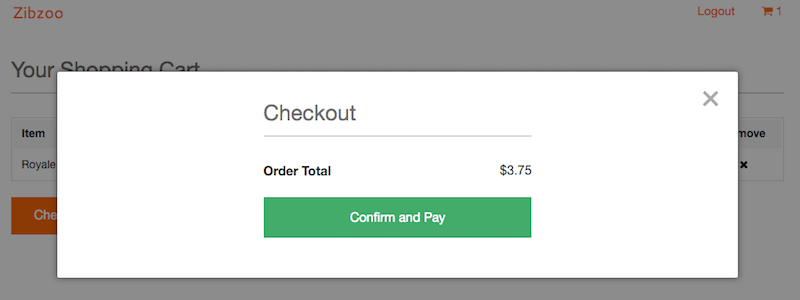

- Don't want to head out untill your food is ready? Don't have the time to get out there untill you know your food is ready.  Well we have you covered.  Once a vendor finishes you food, you'll automaticaly receive an email letting you know its all finsihed.

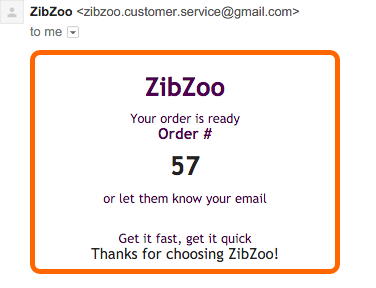

# Vendor Interaction

- Coming to Zibzoo as a vendor and woundering how we can help you out?  Well when you sign up with Zibzoo we try to make things easy for you.

- Edit your profile

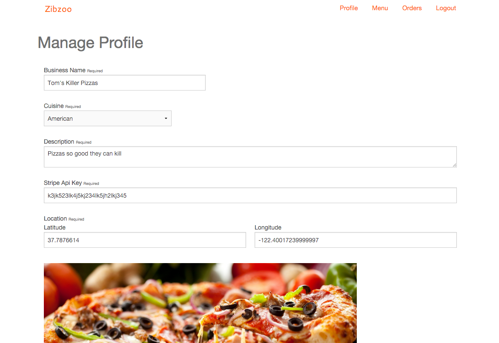

- Add items to your menu

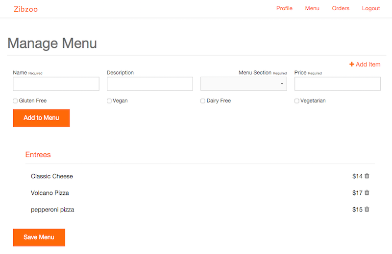

- Need to reorganize your menu? no problem simply drag and drop any item or any catagorie of food

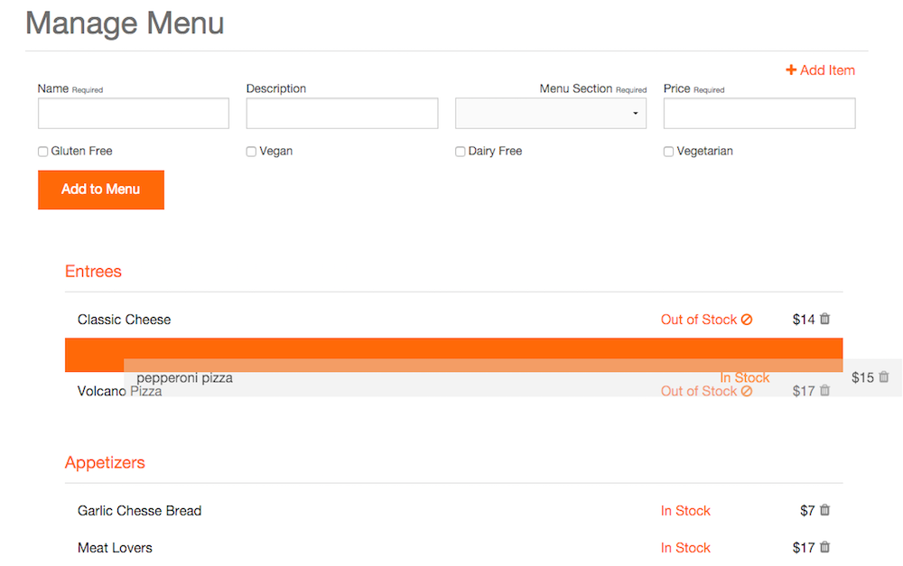

- Finaly take care of all your orders.  You can remove individual food items from orders, or complete an order all together. View how many orders you currently have, as well as a counter for how many orders you've had this session.  Dont worry about contacting people, when you finish an order we automaticaly send off emails to the person who ordered it.  Just make sure to write down their order numbers and emails just in case.

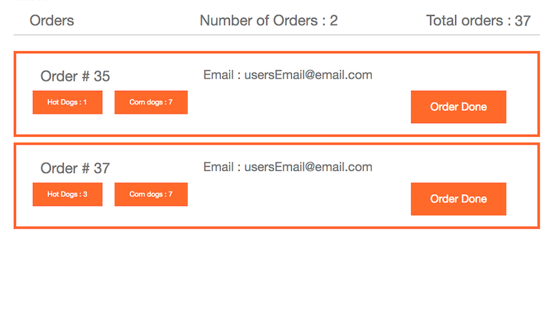

